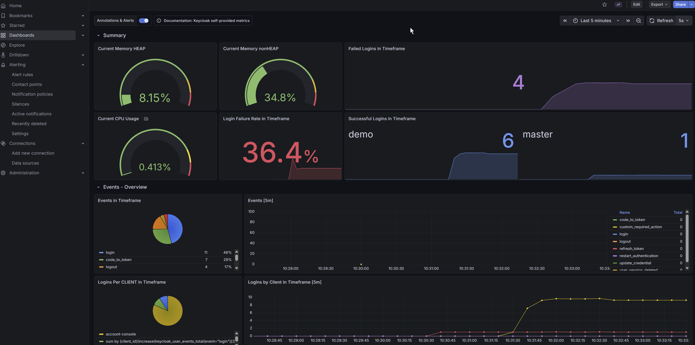
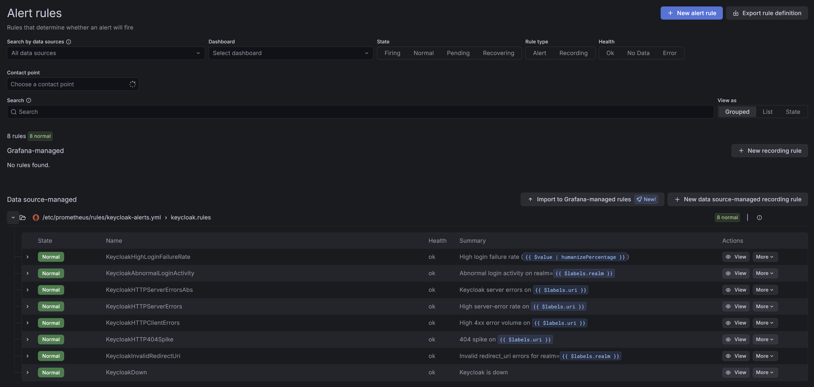
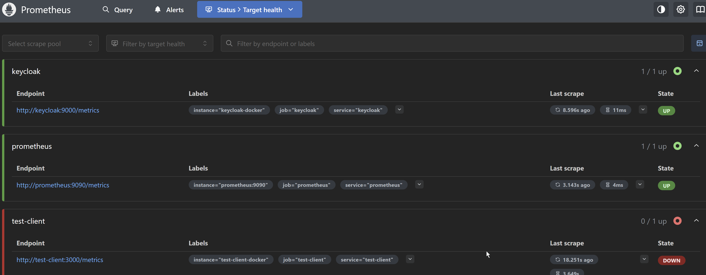

# Observability – Grafana & Prometheus

The playground ships pre-configured Grafana dashboards and Prometheus scrape rules for
Keycloak metrics out of the box.

## Gallery

|                     Dashboards                     |                 Alert Rules                  |
| :------------------------------------------------: | :------------------------------------------: |
|  |  |

|                 Prometheus – targets                 |
| :--------------------------------------------------: |
|  |

## Services

| Service    | URL                   | Credentials   |
| ---------- | --------------------- | ------------- |
| Grafana    | http://localhost:3001 | admin / admin |
| Prometheus | http://localhost:9090 | —             |

Both start with `docker compose up -d` — no extra steps needed.

## Keycloak User Events

User events are the primary security signal. Keycloak tracks every authentication
action and admin configuration change. The playground configures this automatically
via [`tofu/realm-events.tf`](../tofu/realm-events.tf).

### What's configured

```hcl
events_enabled    = true
events_expiration = 604800        # retained 7 days in the DB
events_listeners  = ["jboss-logging"]   # → container stdout / docker logs

enabled_event_types = [
  "LOGIN", "LOGIN_ERROR",
  "LOGOUT",
  "REGISTER", "REGISTER_ERROR",
  "UPDATE_PASSWORD", "UPDATE_PASSWORD_ERROR",
  "VERIFY_EMAIL", "SEND_VERIFY_EMAIL",
  "SEND_RESET_PASSWORD",
  "REMOVE_TOTP", "UPDATE_TOTP",
  "UPDATE_EMAIL",
  "CLIENT_LOGIN", "CLIENT_LOGIN_ERROR",
]

admin_events_enabled         = true
admin_events_details_enabled = true   # full request/resource body in admin events
```

### View events in the Admin Console

```
http://localhost:8080/admin/master/console/#/demo/events
```

Filter by event type, user, client, IP, or time range. Admin events are at the
**Admin events** tab — they record every realm/client/user/role configuration change
with the full diff payload.

### Query events via REST API

```bash
# All events (last 100)
curl -s -H "Authorization: Bearer $ADMIN_TOKEN" \
  "http://localhost:8080/admin/realms/demo/events?max=100" | jq

# Login errors only
curl -s -H "Authorization: Bearer $ADMIN_TOKEN" \
  "http://localhost:8080/admin/realms/demo/events?type=LOGIN_ERROR&max=50" | jq

# Events for a specific user
curl -s -H "Authorization: Bearer $ADMIN_TOKEN" \
  "http://localhost:8080/admin/realms/demo/events?user=testuser1%40example.com" | jq

# Admin events (config changes)
curl -s -H "Authorization: Bearer $ADMIN_TOKEN" \
  "http://localhost:8080/admin/realms/demo/admin-events?max=50" | jq
```

Get an admin token:

```bash
curl -s -X POST http://localhost:8080/realms/master/protocol/openid-connect/token \
  -d "grant_type=password&client_id=admin-cli&username=admin&password=admin" \
  | jq -r .access_token
```

### Stream events from container logs

Because `jboss-logging` is configured as an event listener, every user event is
also written to the Keycloak container log:

```bash
docker compose logs -f keycloak | grep "type="
# 2026-02-24 ... KC-SERVICES0097: type=LOGIN, realmId=demo, clientId=test-client,
#   userId=..., ipAddress=172.18.0.1, error=null, username=testuser1@example.com
```

### Event types reference

| Category         | Event types                                                                |
| ---------------- | -------------------------------------------------------------------------- |
| Authentication   | `LOGIN`, `LOGIN_ERROR`, `LOGOUT`                                           |
| Registration     | `REGISTER`, `REGISTER_ERROR`                                               |
| 2FA / TOTP       | `UPDATE_TOTP`, `REMOVE_TOTP`                                               |
| Email            | `VERIFY_EMAIL`, `SEND_VERIFY_EMAIL`, `SEND_RESET_PASSWORD`, `UPDATE_EMAIL` |
| Service accounts | `CLIENT_LOGIN`, `CLIENT_LOGIN_ERROR`                                       |
| Credentials      | `UPDATE_PASSWORD`, `UPDATE_PASSWORD_ERROR`                                 |
| Admin (config)   | any realm/user/client/role write via Admin API                             |

## Keycloak metrics

The Prometheus metrics are **aggregated event counters** suitable for dashboards and
alerts. For individual event details (who logged in from where, when) use the
[Admin Console or REST API](#view-events-in-the-admin-console) above.

Keycloak exposes Prometheus metrics at:

```
http://localhost:8080/realms/master/metrics          # realm metrics
http://localhost:8080/metrics                        # management metrics (start-dev)
```

Prometheus scrapes them via the config in `prometheus/prometheus.yml`.

### `keycloak_user_events_total` — the star metric

Keycloak 26 ships a **native** user-event metric that does not require any external
SPI extension. It is enabled in [`docker-compose.yaml`](../docker-compose.yaml):

```yaml
KC_METRICS_ENABLED: "true"
# User-event metrics (Keycloak 26+ native, no kc.sh build needed in start-dev)
# https://www.keycloak.org/observability/event-metrics
KC_FEATURES: "user-event-metrics"
KC_EVENT_METRICS_USER_ENABLED: "true"
KC_EVENT_METRICS_USER_TAGS: "realm,clientId" # label dimensions on the metric
```

The resulting metric has the following labels:

| Label       | Example values                   | Controlled by                |
| ----------- | -------------------------------- | ---------------------------- |
| `event`     | `login`, `logout`, `register`, … | Keycloak event type          |
| `error`     | `""` (success) or error code     | Keycloak event outcome       |
| `realm`     | `demo`                           | `KC_EVENT_METRICS_USER_TAGS` |
| `client_id` | `test-client`                    | `KC_EVENT_METRICS_USER_TAGS` |

### Key metrics

| Metric                              | Description                                           |
| ----------------------------------- | ----------------------------------------------------- |
| `keycloak_user_events_total`        | All user events — primary metric (Keycloak 26 native) |
| `keycloak_active_sessions`          | Active sessions per realm                             |
| `keycloak_request_duration_seconds` | HTTP request latency (histogram)                      |
| `jvm_memory_used_bytes`             | JVM heap/non-heap usage                               |
| `process_cpu_usage`                 | Keycloak process CPU                                  |

### Useful PromQL queries

These match the queries used in the provisioned Grafana dashboard:

```promql
# Successful logins in timeframe (by realm)
sum(increase(keycloak_user_events_total{error="", event="login"}[$__range])) by (realm)

# Failed logins in timeframe (by realm)
sum(increase(keycloak_user_events_total{event="login", error!=""}[$__range])) by (realm)

# Login failure rate in timeframe
sum(increase(keycloak_user_events_total{event="login", error!=""}[$__range]))
  / sum(increase(keycloak_user_events_total{event="login"}[$__range]))

# All event types — rolling 5m (for time-series panel)
sum by (event)(increase(keycloak_user_events_total{}[5m]))

# Logins per client in timeframe
sum by (client_id)(increase(keycloak_user_events_total{event="login"}[$__range])) > 0

# p99 token endpoint latency
histogram_quantile(0.99,
  rate(keycloak_request_duration_seconds_bucket{
    endpoint="/realms/demo/protocol/openid-connect/token"}[5m])
)
```

## Grafana dashboards

Dashboards are provisioned from `grafana/provisioning/dashboards/` and loaded
automatically on `docker compose up`.

To add a new dashboard:

1. Design it in the Grafana UI
2. Export as JSON: Dashboard → Share → Export → Save to file
3. Drop the JSON into `grafana/provisioning/dashboards/`
4. `docker compose restart grafana`

## Alert rules

Rules live in [`prometheus/rules/keycloak-alerts.yml`](../prometheus/rules/keycloak-alerts.yml).
All security-relevant rules use the native `keycloak_user_events_total` metric —
no external SPI extension required.

| Alert                           | Condition                                               | Severity |
| ------------------------------- | ------------------------------------------------------- | -------- |
| `KeycloakHighLoginFailureRate`  | >10 % of logins failed in 30 m                          | critical |
| `KeycloakAbnormalLoginActivity` | >100 login errors in 30 m per realm/client              | warning  |
| `KeycloakInvalidRedirectUri`    | >30 `invalid_redirect_uri` errors in 30 m               | critical |
| `KeycloakHTTPServerErrors`      | >1 % of requests returned 5xx in 1 h                    | critical |
| `KeycloakHTTPServerErrorsAbs`   | >10 server errors in 1 h per URI                        | info     |
| `KeycloakHTTPClientErrors`      | >400 4xx responses in 1 h (excl. token/login endpoints) | warning  |
| `KeycloakHTTP404Spike`          | ≥350 × 404 in 30 m per URI                              | warning  |
| `KeycloakDown`                  | Prometheus cannot reach metrics endpoint                | critical |

The login-failure rules use `event="login_error"` (separate error-event style) rather
than the `error!=""` label filter used in the dashboard — both patterns work;
`login_error` is how Keycloak emits the dedicated failure event type.

```bash
# Reload rules without restarting Prometheus
curl -X POST http://localhost:9090/-/reload

# Check active alerts
curl -s http://localhost:9090/api/v1/alerts | jq '.data.alerts[]'
```

## File layout

```
grafana/
  grafana.ini                         ← server config (anonymous access enabled)
  provisioning/
    dashboards/                       ← JSON dashboard files auto-loaded at startup
    datasources/                      ← Prometheus datasource definition

prometheus/
  prometheus.yml                      ← scrape config (Docker network targets)
  prometheus-docker.yml               ← alternate config for Docker host networking
  rules/                              ← alerting rules
```

## Resources

- [Keycloak Event Metrics (26+ native)](https://www.keycloak.org/observability/event-metrics)
- [Keycloak Events docs](https://www.keycloak.org/docs/latest/server_admin/#auditing-and-events)
- [Keycloak Admin Events REST API](https://www.keycloak.org/docs-api/latest/rest-api/index.html#_events)
- [Grafana provisioning docs](https://grafana.com/docs/grafana/latest/administration/provisioning/)
- [Prometheus querying basics](https://prometheus.io/docs/prometheus/latest/querying/basics/)
