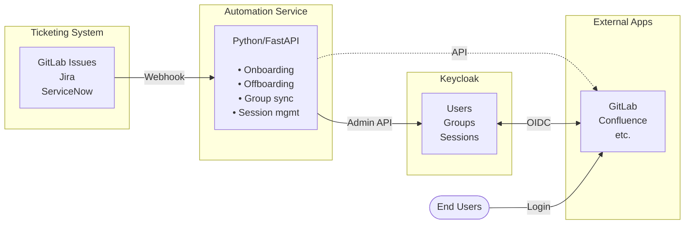

# User Lifecycle Automation

Automated user onboarding and offboarding workflows for Keycloak integrated with external systems like GitLab, Jira, or other ticketing systems.

## The Problem: Manual Lifecycle Management Doesn't Scale

When using Keycloak as a central identity provider for multiple applications, manual user lifecycle management creates operational overhead:

**Onboarding challenges:**

- Inconsistent required actions (password reset, 2FA enrollment)
- Manual group/role assignment across multiple systems
- No audit trail for who onboarded whom and when
- Time-consuming for administrators

**Offboarding challenges:**

- Users remain active in external systems after being disabled in Keycloak
- Active sessions persist even after user deactivation
- Manual session termination required across multiple applications
- Security risk: disabled users can continue accessing resources

## The Solution: Automated Workflows

This playground demonstrates automation patterns for:

1. **Onboarding**: Automatically provision users with correct settings
2. **Group synchronization**: Keep group membership consistent across systems
3. **Offboarding**: Disable users and terminate all active sessions

### Architecture



## Use Case: GitLab Integration

The playground includes a complete automation example for GitLab, demonstrating two critical gaps:

### Gap 1: OIDC Group Assignment

**Problem:** OIDC doesn't support automatic group assignment based on claims.

GitLab can authenticate users via OIDC and read the `groups` claim from Keycloak, but **cannot** automatically assign users to GitLab groups based on those claims. This is an OIDC spec limitation—only SAML supports attribute-based group mapping.

**Related spec limitations:**

- OIDC spec has no standardized group assignment behavior
- SAML `AttributeStatement` exists, but OIDC doesn't have an equivalent

**Solution:** Scheduled synchronization

```bash
cd automation
uv run ./automate.py sync-groups   # Manual sync

# Or run scheduler for automatic sync
uv run ./server.py                  # Syncs every N minutes (configurable via cron)
```

The automation service:

1. Reads Keycloak group membership via Admin API
2. Reads GitLab group membership via GitLab API
3. Calculates the diff (users to add/remove)
4. Updates GitLab groups to match Keycloak (single source of truth)

**Alternative:** Use SAML instead of OIDC for GitLab (instant group assignment on login, but more complex setup).

### Gap 2: Backchannel Logout

**Problem:** GitLab doesn't support OIDC Back-Channel Logout.

When a user is disabled in Keycloak, GitLab sessions remain active because GitLab cannot receive logout notifications from Keycloak. This creates a **security risk**: disabled users can continue accessing GitLab until their session expires (hours or days).

**Related issues:**

- [gitlab#449119](https://gitlab.com/gitlab-org/gitlab/-/issues/449119) - GitLab doesn't support OIDC backchannel logout (open since March 2024)
- [omniauth_openid_connect#177](https://github.com/omniauth/omniauth_openid_connect/issues/177) - Underlying Ruby OmniAuth gem also lacks support
- Front-channel logout (iframe-based) cannot be automated via API—requires browser redirect

**Solution:** API-based session termination

```bash
cd automation
uv run ./automate.py offboard-user alice@democorp.com
```

The offboarding workflow:

1. Disables user in Keycloak (`enabled=false`)
2. Terminates all Keycloak sessions via Admin API
3. Terminates GitLab sessions via `POST /users/:id/logout` API

**Contrast with test-client:**

The playground's `test-client` app demonstrates proper Back-Channel Logout implementation at `/backchannel-logout`. When Keycloak sends a logout token, the test-client immediately terminates the user's session. GitLab cannot do this, requiring manual API calls as a workaround.

### Gap 3: Keycloak Session Persistence

**Problem:** Disabling a user in Keycloak doesn't automatically terminate active sessions.

Setting `user.enabled = false` prevents **new** logins, but existing sessions remain valid until expiration. This is Keycloak's default behavior—session tokens are still honored.

**Related issues:**

- [keycloak#8267](https://github.com/keycloak/keycloak/issues/8267) - Feature request: Automatically revoke sessions on user disable (open since 2021)
- [keycloak-discussions#30885](https://github.com/keycloak/keycloak/discussions/30885) - Community workarounds and discussions

**Solution:** Explicit session revocation

```python
# Automation service calls this after disabling user
keycloak_admin.user_logout(user_id)
```

**Workaround stages:**

1. Disable user (`enabled=false`) — blocks new logins
2. Call `user_logout(user_id)` — terminates Keycloak sessions
3. Call external system APIs (e.g., GitLab) — terminates downstream sessions

## Implementation: Automation Service

The playground includes a Python automation service (`automation/`) with:

### CLI for Manual Operations

```bash
cd automation
uv sync   # Install dependencies

# Onboard user (set required actions, assign groups)
uv run ./automate.py onboard-user alice@democorp.com --groups gitlab-admins,demo-team-alpha

# Offboard user (disable, logout everywhere)
uv run ./automate.py offboard-user alice@democorp.com

# Sync groups from Keycloak to GitLab
uv run ./automate.py sync-groups

# Check user status
uv run ./automate.py user-status alice@democorp.com
```

### Webhook Server for Automation

```bash
cd automation
uv run ./server.py   # Starts FastAPI server on :8000
```

Features:

- **Scheduled group sync**: `GROUP_SYNC_CRON` env var (e.g., `*/10 * * * *` for every 10 minutes)
- **Webhook endpoints**: Respond to GitLab or custom ticket system events
- **Health checks**: `/health`, `/api/sync-status`
- **Manual triggers**: `POST /api/sync-groups`, `POST /api/onboard`, `POST /api/offboard`

### Configuration

```bash
cd automation
cp .env.example .env
```

Key settings:

```bash
# Keycloak Admin API
KEYCLOAK_URL=http://localhost:8080
KEYCLOAK_REALM=demo
KEYCLOAK_CLIENT_ID=admin-cli
KEYCLOAK_CLIENT_SECRET=...

# GitLab API (if using group sync)
GITLAB_URL=http://localhost:8929
GITLAB_TOKEN=...

# Group sync schedule (cron syntax)
GROUP_SYNC_CRON=*/10 * * * *   # Every 10 minutes

# Onboarding defaults
DEFAULT_REQUIRED_ACTIONS=UPDATE_PASSWORD,CONFIGURE_TOTP
```

## Extending to Other Systems

The automation patterns demonstrated with GitLab apply to any OIDC-integrated system:

### Jira, Confluence, ServiceNow, etc.

Most ticketing/collaboration systems face similar limitations:

1. **Group sync**: OIDC claims are read-only (display purposes), not used for authorization
2. **Session management**: No Back-Channel Logout support in most systems
3. **Manual offboarding**: API calls required to disable users or revoke access

**Adaptation steps:**

1. Replace `automation/clients.py:GitLabClient` with your system's API client
2. Modify `automation/group_sync.py` to use your system's group management API
3. Update `automation/automate.py` offboarding to call your system's session termination endpoint

### Example: Generic Ticketing System

```python
# automation/clients.py — add your system
class TicketSystemClient:
    def get_user(self, email):
        # Call your system's user API
        pass

    def add_user_to_group(self, email, group):
        # Call your system's group API
        pass

    def terminate_sessions(self, email):
        # Call your system's logout/session API
        pass

# automation/automate.py — use in offboarding
def offboard_user(email):
    kc_client.disable_user(email)
    kc_client.logout_user(email)
    ticket_client.terminate_sessions(email)  # ← Add this
```

## Testing

The playground's `test-client` app demonstrates correct OIDC patterns:

- ✅ **Back-Channel Logout**: `/backchannel-logout` endpoint handles logout tokens
- ✅ **Manual logout API**: `/admin/logout/<user>` for forced session termination
- ✅ **Session tracking**: Validates logout tokens against active sessions

Run tests:

```bash
cd smoke-tests
uv run pytest -v -k test_backchannel_logout
```

## Best Practices

### Onboarding

1. **Set required actions** in Keycloak (password reset, 2FA) instead of sending credentials
2. **Use webhook automation** triggered from HR systems or ticket creation
3. **Audit trail**: Log all onboarding events with timestamp and operator
4. **Dry-run mode**: Test automation with `--dry-run` flag before production

### Offboarding

1. **Immediate disable**: Set `enabled=false` first to block new logins
2. **Terminate sessions**: Call `user_logout()` in Keycloak
3. **Downstream cleanup**: Revoke access in all integrated systems (GitLab, etc.)
4. **Verify**: Check session status in monitoring/observability tools
5. **Archive, don't delete**: Keep user records for audit compliance

### Group Sync

1. **Keycloak as source of truth**: Never manually edit groups in downstream systems
2. **Conservative schedule**: Start with longer intervals (every 30 min) to avoid API rate limits
3. **Monitor sync health**: Track failed syncs and set up alerts
4. **Read-only groups**: Mark certain groups as protected from automation if needed

## Limitations and Trade-offs

| Approach                                                                       | Pros                               | Cons                                              |
| ------------------------------------------------------------------------------ | ---------------------------------- | ------------------------------------------------- |
| **OIDC + Automation**                                                          | Modern, well-supported, flexible   | Requires custom automation service                |
| **SAML (GitLab only)**                                                         | Instant group assignment on login  | Complex setup, no backchannel logout              |
| **Manual management**                                                          | Simple for small teams (<10 users) | Not scalable, error-prone, slow                   |
| **SCIM** ([keycloak#18152](https://github.com/keycloak/keycloak/issues/18152)) | Standardized provisioning protocol | Not yet supported in Keycloak (as of Keycloak 26) |

## Further Reading

- [automation/README.md](../../automation/README.md) - Full automation service documentation
- [../observability.md](observability.md) - Monitor user lifecycle events
- [docs/explanation/adrs/0001-keycloak-security-architecture.md](../../explanation/adrs/0001-keycloak-security-architecture.md) - Design rationale

**Open issues (community involvement welcome):**

- [keycloak#8267](https://github.com/keycloak/keycloak/issues/8267) - Auto-revoke sessions on user disable
- [keycloak#18152](https://github.com/keycloak/keycloak/issues/18152) - SCIM support for Keycloak
- [gitlab#449119](https://gitlab.com/gitlab-org/gitlab/-/issues/449119) - OIDC Back-Channel Logout support
- [omniauth_openid_connect#177](https://github.com/omniauth/omniauth_openid_connect/issues/177) - Ruby gem backchannel logout
