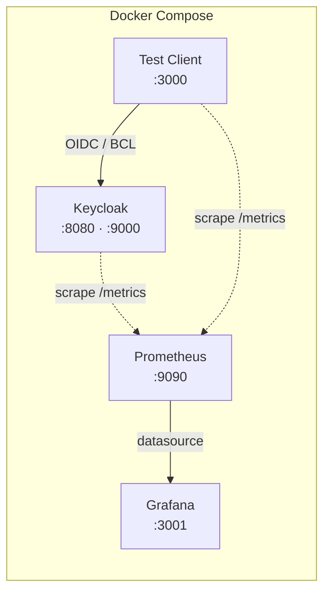

# Keycloak Playground Documentation

Local Keycloak 26 development environment for testing OIDC integrations, custom themes, and observability.

This documentation follows the [Diátaxis framework](https://diataxis.fr/) for clear organization:

## 📘 Tutorials

_Learning-oriented: Get started with step-by-step guidance_

See **[Tutorials](tutorials/)** for available guides.

## 📖 How-to Guides

_Task-oriented: Solve specific problems_

See **[How-to Guides](how-to-guides/)** for all available guides.

## 📚 Reference

_Information-oriented: Technical details and specifications_

See **[Reference](reference/)** for technical documentation.

## 💡 Explanation

_Understanding-oriented: Background, concepts, and design_

See **[Explanation](explanation/)** for design decisions and architecture rationale.

---

## Quick Reference

| Service     | URL                   | Credentials |
| ----------- | --------------------- | ----------- |
| Keycloak    | http://localhost:8080 | admin/admin |
| Test Client | http://localhost:3000 | —           |
| Grafana     | http://localhost:3001 | admin/admin |
| Prometheus  | http://localhost:9090 | —           |

## Architecture

