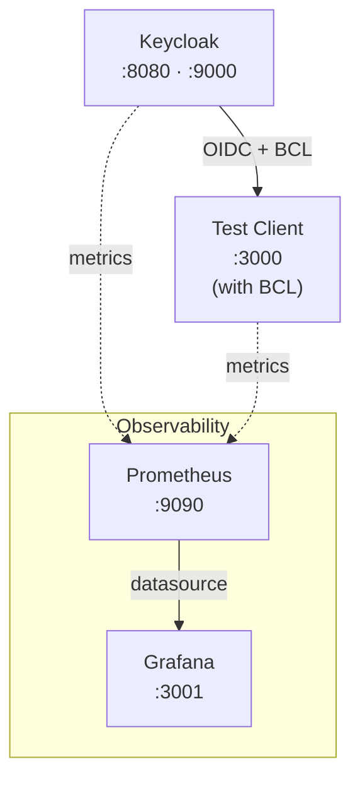

# Architecture

## System Overview

## Components

### Keycloak

Central identity provider and authentication server.

- **Ports**: 8080 (HTTP), 9000 (metrics/health)
- **Admin Console**: http://localhost:8080/admin (admin/admin)
- **Features**: User-event metrics (Keycloak 26+)

### Test Client

Python (FastAPI) OIDC demo application with proper **Back-Channel Logout** implementation.

- **URL**: http://localhost:3000
- **Endpoint**: `/backchannel-logout` receives logout tokens from Keycloak
- **Purpose**: Demonstrates OIDC BCL—what GitLab is missing ([gitlab#449119](https://gitlab.com/gitlab-org/gitlab/-/issues/449119))

See [../../test-client/README.md](../../test-client/README.md) for details.

### Smoke Tests

Pytest + Playwright browser automation to verify the full authentication flow.

- **Location**: `smoke-tests/`
- **Coverage**: Login, OIDC flow, logout, user management

See [../../smoke-tests/README.md](../../smoke-tests/README.md) for details.

### Observability Stack

#### Prometheus

Metrics collection and storage.

- **URL**: http://localhost:9090
- **Targets**: Keycloak (:9000/metrics), test-client (:3000/metrics)

#### Grafana

Metrics visualization with pre-configured Keycloak dashboards.

- **URL**: http://localhost:3001
- **Credentials**: admin/admin
- **Datasource**: Prometheus (auto-provisioned)

See [../how-to-guides/observability.md](../how-to-guides/observability.md) for setup.

### Custom Theme

[Keycloakify 11](https://keycloakify.dev) starter with Vite + React + TypeScript.

- **Location**: `keycloak/theme/`
- **Features**: Live reload, Storybook, TypeScript
- **Build**: `npm run build-keycloak-theme`

See [../how-to-guides/theme.md](../how-to-guides/theme.md) for development workflow.

### Automation Service

User lifecycle automation with CLI and webhook server.

- **Location**: `automation/`
- **Features**: Onboarding, offboarding, group sync
- **Purpose**: Workarounds for OIDC limitations (Gap 1/2/3)

See [../how-to-guides/user-lifecycle-automation.md](../how-to-guides/user-lifecycle-automation.md) for details.
